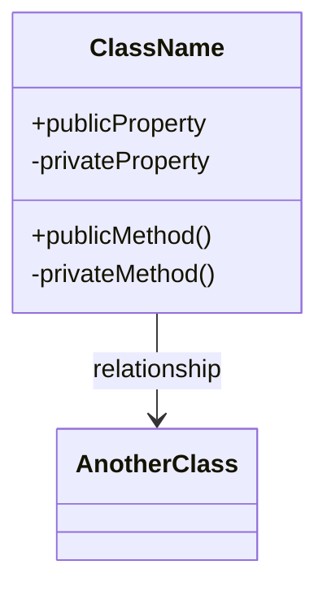

Structured design discussion workflow for implementation tasks. Helps users clarify requirements, explore design options, and produce a design document ready for implementation.

## Workflow Overview

Three-stage process:

1. **Requirements Clarification**: Understand the implementation requirements
2. **Design Exploration**: Explore and evaluate design options
3. **Design Documentation**: Produce structured design output

## Input Modes

This skill supports multiple input modes for flexibility:

### Mode 1: Direct Input

User provides requirements directly in chat. Ask clarifying questions as needed.

### Mode 2: File Reference

User provides a file path containing requirements or specifications.
- Read the file and summarize understanding
- Ask clarifying questions about unclear points

### Mode 3: Workflow Integration

When called from implementation-workflow, receive requirements from the workflow context.

---

## Stage 1: Requirements Clarification

**Goal:** Fully understand what needs to be implemented.

### Initial Questions

Ask these core questions:

1. What is the main functionality to implement?
2. What is the expected input/output?
3. Are there existing codebases or patterns to follow?
4. What are the constraints? (language, framework, performance, etc.)
5. What are the success criteria?

Allow shorthand answers. Encourage context dumping - user can provide related docs, code snippets, or discussions.

### Coding Standards Selection

**Retrieve available standards from coding-standards skill:**

```
# Check available standards
coding-standards

# Example output:
## Available Coding Standards

| Keywords | Language/Standard | File | Status |
|----------|------------------|------|--------|
| unity, unity3d, game | Unity | references/unity/standards.md | ✓ |
| csharp, c#, dotnet | C# Project | references/csharp-project/standards.md | ✓ |

Please select coding standards to use for this implementation.
Multiple selections allowed (e.g., "unity, csharp").
```

**Validate and retrieve standards:**

Validate user's selected standards with coding-standards skill:

```
# Get specific standards
coding-standards <selected_keywords>

# Examples:
coding-standards unity       # Get Unity standards
coding-standards csharp      # Get C# Project standards
```

**When standards not found:**

```
⚠ Specified standards not found.

Please choose:
① Use existing standards (check with coding-standards)
② Create new standards (use coding-standards-creator skill)
③ Proceed with general guidelines
```

Display warning:

```
⚠ {Standard} standards are not yet implemented.
```

Handle user choice:
- **① Use existing:** Ask user to select from available standards
- **② Create new:** Launch new standard creation wizard (see below)
- **③ Skip:** Proceed without coding standards (will use generic checks in code-review)

**New Standard Creation Wizard:**

If user chooses to create new standard:

1. **Explain template structure:**

```
新しいコーディング規約テンプレートを作成します。

基本セクション:
- Naming conventions
- File structure
- Indentation and formatting rules

詳細セクション:
- Comments and documentation rules
- Error handling patterns
- Best practices and anti-patterns
- Language-specific features usage
- Code review checklist
```

2. **Guide user through sections:**
   - Ask for naming conventions (classes, methods, variables, etc.)
   - Ask for formatting rules (indentation, line length, etc.)
   - Ask for any critical rules or prohibited patterns
   - Ask for code examples (optional but recommended)

3. **Generate standard file:**
   - Create `coding-standards/references/{standard}.md` with user input
   - Follow same structure as existing standards
   - Include code examples in appropriate language syntax

4. **Confirm and continue:**
   - Show generated file path
   - Ask user to review
   - Continue with design discussion using new standard

### Clarifying Questions

After initial context:
- Generate 5-10 numbered questions about unclear points
- Focus on edge cases, error handling, integration points
- Ask about non-functional requirements (performance, maintainability)

**Exit condition:** Clear understanding of requirements, constraints, and success criteria.

---

## Stage 2: Design Exploration

**Goal:** Explore design options and make architectural decisions.

### Design Options

Based on requirements, propose 2-4 design approaches:

For each option, outline:
- **Approach**: Brief description
- **Pros**: Benefits of this approach
- **Cons**: Drawbacks or risks
- **Fit**: How well it matches the constraints

Ask user to evaluate options or provide preferences.

### Decision Points

For key architectural decisions:

1. List the decision to make
2. Present options with trade-offs
3. Get user input
4. Document the decision and rationale

Common decision points:
- Module/class structure
- Data flow and state management
- Error handling strategy
- Interface design
- Dependency management

### Refinement

Iterate on the chosen approach:
- Drill down into specific components
- Clarify interfaces between modules
- Address edge cases
- Consider testing strategy

---

## Stage 3: Design Documentation

**Goal:** Produce a structured design document for implementation.

### Output Format

Generate a design document with the following structure:

```markdown
<!-- DESIGN_OUTPUT -->
# Design: {Feature Name}

## Overview
Brief description of what will be implemented.

## Requirements
- Functional requirements (numbered list)
- Non-functional requirements

## Coding Standards
- Applied standards: {selected standards with links}
- Reference: See [coding-standards](../coding-standards/SKILL.md) skill

## Architecture

### Class Diagram



### Module Structure
- Module/class breakdown
- Responsibilities of each component

### Data Flow
- Input → Processing → Output flow
- State management approach

### Interfaces
- Public APIs/methods
- Input/output specifications

## Design Decisions

| Decision | Choice | Rationale |
|----------|--------|-----------|
| ... | ... | ... |

## Implementation Notes
- Specific patterns to follow
- Libraries/dependencies to use
- Known constraints or gotchas
- **Coding standards reference**: {link to applicable standards}

## Testing Strategy
- Unit test approach
- Integration test considerations
- Edge cases to cover

## Open Questions
- Items requiring further clarification during implementation

<!-- /DESIGN_OUTPUT -->
```

### File Output

**Standalone execution:**
Ask user where to save the output file. Suggest a filename based on the feature name:
- Format: `{prefix}_design_output.md`
- Example: `login_design_output.md`

**Workflow integration:**
Output to the path specified by implementation-workflow.

## Prefix Extraction

When creating output files, extract a prefix from the feature/requirement description:

1. Identify the main noun or concept (e.g., "ログイン機能の実装" → 'login', "検索API" → 'search_api')
2. Convert to lowercase, replace spaces with underscores
3. Use ASCII-safe characters only
4. If unclear, ask user to specify a short prefix

## Tips for Effective Design Discussion

- Start broad, then narrow down
- Make implicit assumptions explicit
- Consider future extensibility
- Balance between over-design and under-design
- Document "why" not just "what"
