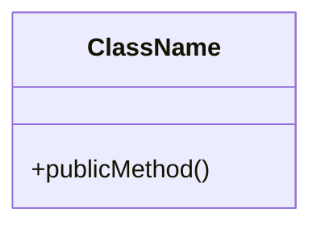

Structured design discussion workflow for implementation tasks. Helps users clarify requirements, explore design options, and produce a design document ready for implementation (by the implementer agent or manual coding).

## Workflow Overview

1. **Requirements Clarification**: Understand the implementation requirements
2. **Design Exploration**: Explore and evaluate design options
3. **Design Documentation**: Produce structured design output

## Input Modes

- **Direct Input**: User provides requirements in chat
- **File Reference**: User provides a file path; read and summarize understanding
- **Workflow Integration**: Called from implementation-workflow with requirements from workflow context

---

## Stage 1: Requirements Clarification

**Goal:** Fully understand what needs to be implemented.

### Initial Questions

1. What is the main functionality to implement?
2. What is the expected input/output?
3. Are there existing codebases or patterns to follow?
4. What are the constraints? (language, framework, performance, etc.)
5. What are the success criteria?

Allow shorthand answers. Encourage context dumping — related docs, code snippets, or discussions.

### Knowledge Pack Selection

実装時にimplementer agentがロードするナレッジパックをここで決定する。

1. **一覧取得**: code-knowledgeスキルの `scripts/list_knowledge.py` で利用可能なパックを取得し、ユーザーに提示
2. **選択**: プロジェクトに合うパックをユーザーが選択（複数可）
3. **制約の先取り**: 選択パックの `core.md` を読み、**致命的制約（例: Unity = LINQ禁止・try-catch禁止）を設計判断に反映**する。詳細セクションはこの段階では読まない

**該当パックがない場合:**

```
⚠ 該当するナレッジパックが見つかりません。

① 既存パックから選ぶ
② code-knowledge-creator スキルで新規パックを作成する（推奨: 制約が明確なプロジェクトの場合）
③ 一般的なベストプラクティスで進める
```

②を選んだ場合はcode-knowledge-creatorスキルに移行し、パック作成後に設計議論へ戻る。

### Clarifying Questions

- Generate 5-10 numbered questions about unclear points
- Focus on edge cases, error handling, integration points
- Ask about non-functional requirements (performance, maintainability)

**Exit condition:** Clear understanding of requirements, constraints, and success criteria.

---

## Stage 2: Design Exploration

**Goal:** Explore design options and make architectural decisions.

### Design Options

Propose 2-4 design approaches. For each: **Approach** / **Pros** / **Cons** / **Fit**（ナレッジパックの制約との整合を含む）. Ask user to evaluate.

### Decision Points

For key architectural decisions: list the decision → present options with trade-offs → get user input → document decision and rationale.

Common decision points: module/class structure, data flow and state management, error handling strategy（パックの制約に従う）, interface design, dependency management.

### Refinement

Drill down into components, clarify interfaces, address edge cases, consider testing strategy.

---

## Stage 3: Design Documentation

**Goal:** Produce a design document that the implementer agent can execute autonomously.

設計書は**implementer agentが対話なしで実装できる粒度**で書く。曖昧さはOpen Questionsとして明示する。

### Output Format

```markdown
<!-- DESIGN_OUTPUT -->
# Design: {Feature Name}

## Overview
Brief description of what will be implemented.

## Requirements
- Functional requirements (numbered list)
- Non-functional requirements

## Knowledge Pack
- Pack: {pack key（例: unity）}    ← implementer agentがこのキーでcore.md等をロードする
- 設計に影響した制約: {例: try-catch禁止のためResult型でエラー伝搬}

## Architecture

### Class Diagram

```mermaid
classDiagram
    class ClassName {
        +publicMethod()
    }
```

### Module Structure
- Module/class breakdown and responsibilities

### Data Flow
- Input → Processing → Output flow, state management

### Interfaces
- Public APIs/methods, input/output specifications

## Design Decisions
| Decision | Choice | Rationale |
|----------|--------|-----------|

## Implementation Notes
- Specific patterns to follow, libraries/dependencies, known constraints
- Target directory for implementation

## Testing Strategy
- Unit test approach, integration considerations, edge cases

## Open Questions
- Items requiring clarification during implementation
<!-- /DESIGN_OUTPUT -->
```

### File Output

- **Standalone**: Suggest `{prefix}_design_output.md`（prefix = 主要概念の小文字ASCII。不明ならユーザーに確認）
- **Workflow integration**: Output to the path specified by implementation-workflow

## Tips for Effective Design Discussion

- Start broad, then narrow down
- Make implicit assumptions explicit
- Balance between over-design and under-design
- Document "why" not just "what"
- パックの致命的制約は設計段階で織り込む（実装段階での手戻りを防ぐ）
