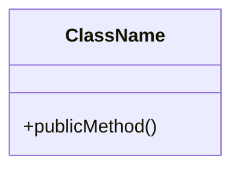

Structured design discussion workflow for implementation tasks. Helps users clarify requirements, explore design options, and produce a design document ready for implementation (by the implementer agent or manual coding). Communicate with the user in Japanese.

## Workflow Overview

1. **Requirements Clarification**: Understand the implementation requirements
2. **Design Exploration**: Explore and evaluate design options
3. **Design Documentation**: Produce structured design output

## Input Modes

- **Direct Input**: User provides requirements in chat
- **File Reference**: User provides a file path; read and summarize understanding
- **Workflow Integration**: Called from implementation-workflow with requirements from workflow context

---

## Stage 1: Requirements Clarification

**Goal:** Fully understand what needs to be implemented.

### Initial Questions

1. What is the main functionality to implement?
2. What is the expected input/output?
3. Are there existing codebases or patterns to follow?
4. What are the constraints? (language, framework, performance, etc.)
5. What are the success criteria?

Allow shorthand answers. Encourage context dumping — related docs, code snippets, or discussions.

### Knowledge Pack Selection

Decide here which knowledge pack the implementer agent will load.

1. **List packs**: run code-knowledge's `scripts/list_knowledge.py` and present available packs
2. **Select**: user picks the pack(s) matching the project
3. **Front-load constraints**: read the selected pack's `core.md` and **reflect its critical constraints in design decisions** (e.g., Unity = no LINQ, no try-catch). Do not read detail sections at this stage

**When no pack matches:**

```
⚠ 該当するナレッジパックが見つかりません。

① 既存パックから選ぶ
② code-knowledge-creator スキルで新規パックを作成する（推奨: 制約が明確なプロジェクトの場合）
③ 一般的なベストプラクティスで進める
```

If ② is chosen, switch to the code-knowledge-creator skill and return to design discussion after the pack is created.

### Clarifying Questions

- Generate 5-10 numbered questions about unclear points
- Focus on edge cases, error handling, integration points
- Ask about non-functional requirements (performance, maintainability)

**Exit condition:** Clear understanding of requirements, constraints, and success criteria.

---

## Stage 2: Design Exploration

**Goal:** Explore design options and make architectural decisions.

### Design Options

Propose 2-4 design approaches. For each: **Approach** / **Pros** / **Cons** / **Fit** (including consistency with the knowledge pack constraints). Ask user to evaluate.

### Decision Points

For key architectural decisions: list the decision → present options with trade-offs → get user input → document decision and rationale.

Common decision points: module/class structure, data flow and state management, error handling strategy (follow pack constraints), interface design, dependency management.

### Refinement

Drill down into components, clarify interfaces, address edge cases, consider testing strategy.

---

## Stage 3: Design Documentation

**Goal:** Produce a design document that the implementer agent can execute autonomously.

Write the design at a granularity that **the implementer agent can implement without dialogue**. Make ambiguities explicit as Open Questions.

### Output Format

```markdown
<!-- DESIGN_OUTPUT -->
# Design: {Feature Name}

## Overview
Brief description of what will be implemented.

## Requirements
- Functional requirements (numbered list)
- Non-functional requirements

## Knowledge Pack
- Pack: {pack key (e.g., unity)}    ← the implementer agent loads core.md etc. with this key
- Constraints that shaped the design: {e.g., Result-based error propagation due to no-try-catch rule}

## Architecture

### Class Diagram

```mermaid
classDiagram
    class ClassName {
        +publicMethod()
    }
```

### Module Structure
- Module/class breakdown and responsibilities

### Data Flow
- Input → Processing → Output flow, state management

### Interfaces
- Public APIs/methods, input/output specifications

## Design Decisions
| Decision | Choice | Rationale |
|----------|--------|-----------|

## Implementation Notes
- Specific patterns to follow, libraries/dependencies, known constraints
- Target directory for implementation

## Testing Strategy
- Unit test approach, integration considerations, edge cases

## Open Questions
- Items requiring clarification during implementation
<!-- /DESIGN_OUTPUT -->
```

### File Output

- **Standalone**: Suggest `{prefix}_design_output.md` (prefix = main concept in lowercase ASCII; ask the user if unclear)
- **Workflow integration**: Output to the path specified by implementation-workflow

## Tips for Effective Design Discussion

- Start broad, then narrow down
- Make implicit assumptions explicit
- Balance between over-design and under-design
- Document "why" not just "what"
- Bake the pack's critical constraints into the design stage (prevents rework during implementation)
